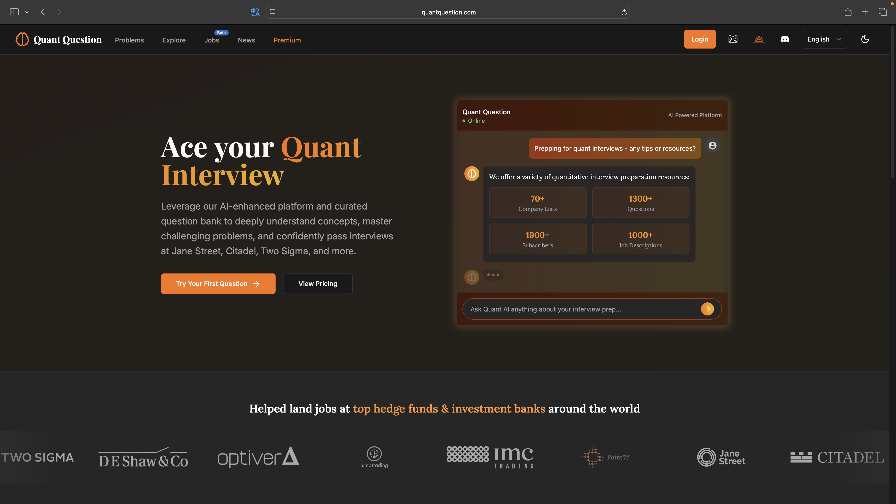
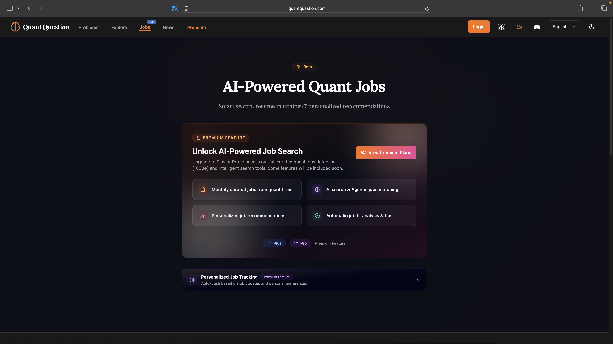

# Welcome to Quant Wiki

### We are dedicated to open-source quantitative finance education, bridging the global knowledge gap

Quantitative investing (Quant) is an investment approach grounded in mathematical models, statistical analysis, and algorithmic decision-making. It represents one of the most important branches of modern finance.

Quantitative trading is driven by institutions such as hedge funds and investment banks, leveraging data-driven methods for market analysis and trade execution. By harnessing the power of computers and algorithms, quantitative trading can efficiently process vast datasets and rapidly identify arbitrage opportunities and market trends. In today's era of rapid **artificial intelligence** advancement, exploring how cutting-edge AI techniques can enhance quantitative trading is a key question for every quant practitioner -- and a central focus of our work.

**Quant Wiki** is committed to building a **free, open-access**, and **continuously updated** knowledge-sharing platform for quantitative finance. Here you can learn about the core concepts of quantitative trading, commonly used models, algorithm design, and real-world trading strategies. We offer a wealth of resources covering factor models, event-driven strategies, execution cost optimization, and more -- helping you master the essential skills of quantitative investing and advance on your professional journey.

This project is funded and supported by the [LLMQuant Community](https://llmquant.com/). Contributions and support are welcome.

??? tip "Quant Wiki WeChat Discussion Group"
    Join the Quant Wiki WeChat discussion group to share your suggestions and feedback. (Since WeChat group QR codes expire after 7 days, please add the LLMQuant admin on WeChat first and mention your interest.)
    

### Practice and Career Tools

???+ example "Quant Question -- Interview Prep & Practice Platform"
    

    

**Quant Wiki is for learning. Quant Question is for practice.**

To go beyond theory, we recommend [Quant Question](https://www.quantquestion.com) -- our flagship product. It is a professional, AI-powered quantitative interview and career preparation platform featuring 1,300+ practice problems, 1,000+ job listings at top firms, curated problem sets from real interviews, QuantAI real-time personalized coaching, and AI-driven job tracking tools to help you succeed in interviews at leading hedge funds and quantitative firms.

We understand the value of accessible learning resources. While the platform offers premium features, it also provides **a large selection of free, curated problem sets**. Whether you want to reinforce probability and statistics concepts from the Wiki or work through real interview questions from top firms, you will find free resources here.

